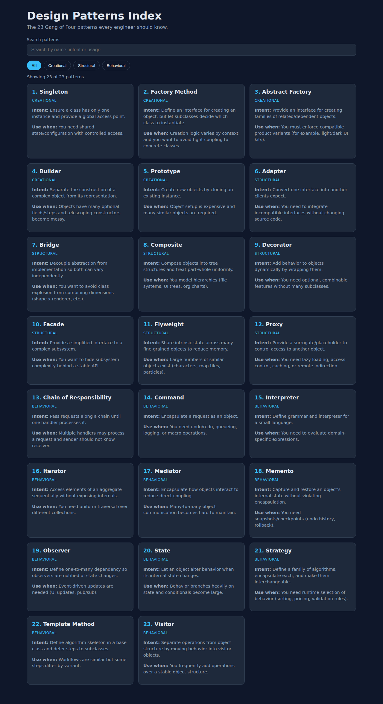

# Design Patterns Index (React)

A React + TypeScript single-page index of the 23 Gang of Four design patterns
documented in the [repository README](../README.md). Patterns can be searched by
name/intent/usage and filtered by category.



## Getting started

```bash
cd web
npm install
npm run dev
```

## Scripts

| Script | Description |
| --- | --- |
| `npm run dev` | Start the Vite dev server |
| `npm run build` | Type-check and build for production |
| `npm run preview` | Serve the production build |
| `npm run lint` | Lint with oxlint |
| `npm test` | Run unit + scenario tests (Vitest) |
| `npm run test:coverage` | Run tests with coverage (100% thresholds enforced) |
| `npm run test:e2e` | Run Playwright end-to-end scenarios |

## Folder structure

```
web/
├── index.html
├── playwright.config.ts      # E2E test configuration
├── vite.config.ts            # Vite + Vitest (unit test) configuration
├── docs/screenshots/         # UI screenshots
├── src/
│   ├── components/           # Presentational components (+ __tests__)
│   ├── data/                 # Static GoF pattern catalog (+ __tests__)
│   ├── hooks/                # Reusable state logic (+ __tests__)
│   ├── pages/                # Page-level composition (+ __tests__)
│   ├── styles/               # Global stylesheet
│   ├── test/                 # Test setup files
│   ├── types/                # Shared TypeScript types
│   ├── utils/                # Pure helpers (+ __tests__)
│   ├── App.tsx
│   └── main.tsx
└── tests/e2e/                # Playwright scenario tests
```

## Testing

- **Unit tests** (`src/**/__tests__`) cover every component, hook, util, the
  data set and the app entry point. Coverage thresholds are set to 100% for
  statements, branches, functions and lines.
- **Scenario tests** cover complete user journeys (search, filter, empty state
  recovery) both at the component level with Testing Library and end-to-end in a
  real browser with Playwright.
